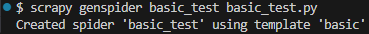

# scrapy_selenium

## 목표

DA, DE를 준비하면서 항상 느끼는 것이 데이터의 수집에 대한 걱정이었습니다.

RAW DATA가 있어야 이를 DE가 정제하고 DA가 분석한다 생각하여 크롤링을 공부하였습니다.

Scrapy를 활용하여 정적인 웹 크롤링을 구현하고, Selenium을 활용하여 동적인 웹 페이지를 크롤링 하겠습니다.

---

# Scrapy
## Install
*venv 세팅*
```bash
python -m venv venv
```

*scrapy install*
```bash
pip install Scrapy
```

## CLI Tool
*사용 가능한 여러 명령어 확인*
```bash
scrapy -h
```


**새 프로젝트 생성**
(프로젝트 없어도 가능)
```bash
scrapy startproject myproject
```

**스파이터 생성**
(프로젝트 없어도 가능)
*spider template 확인*
```bash
scrapy genspider -l
```


*basic 사용해보기*
```bash
scrapy genspider basic_test basic_test.py
```

+ basic_test.py 코드
```python
import scrapy


class BasicTestSpider(scrapy.Spider):
    name = "basic_test"
    allowed_domains = ["basic_test.py"]
    start_urls = ["https://basic_test.py"]

    def parse(self, response):
        pass
```


*crawl 사용해보기*
```bash
scrapy genspider -t crawl crawl_test crawl_test.py
```

+ crawl_test.py 코드
```python
import scrapy
from scrapy.linkextractors import LinkExtractor
from scrapy.spiders import CrawlSpider, Rule


class CrawlTestSpider(CrawlSpider):
    name = "crawl_test"
    allowed_domains = ["crawl_test.py"]
    start_urls = ["https://crawl_test.py"]

    rules = (Rule(LinkExtractor(allow=r"Items/"), callback="parse_item", follow=True),)

    def parse_item(self, response):
        item = {}
        #item["domain_id"] = response.xpath('//input[@id="sid"]/@value').get()
        #item["name"] = response.xpath('//div[@id="name"]').get()
        #item["description"] = response.xpath('//div[@id="description"]').get()
        return item
```

**crawl 시작**
(프로젝트를 만들어야 사용 가능)
```bash
scrapy crawl myspider
```

*`-o` 옵션을 통해 output 지정 가능*
+ csv로 저장한다면
```bash
scrapy crawl -o myfile:csv myspider
```

+ json으로 저장한다면
```bash
scrapy crawl -o myfile:json myspider
```


**check**
(프로젝트 필요)
contract 확인
*확인 목록 출력*
```bash
scrapy check -l
```

*확인 하기*
```bash
scrapy check
```


**목록**
(프로젝트 필요)
현재 프로젝트에서 사용 가능한 모든 스파이더를 나열
```bash
scrapy list
```


### shell 사용하기

ex) "http://quotes.toscrape.com/"를 예제로 사용

```bash
scrapy shell "http://quotes.toscrape.com/"
```


*html 전체 확인*
```python
print(response.text)
```

*view*
```python
view(response)
```